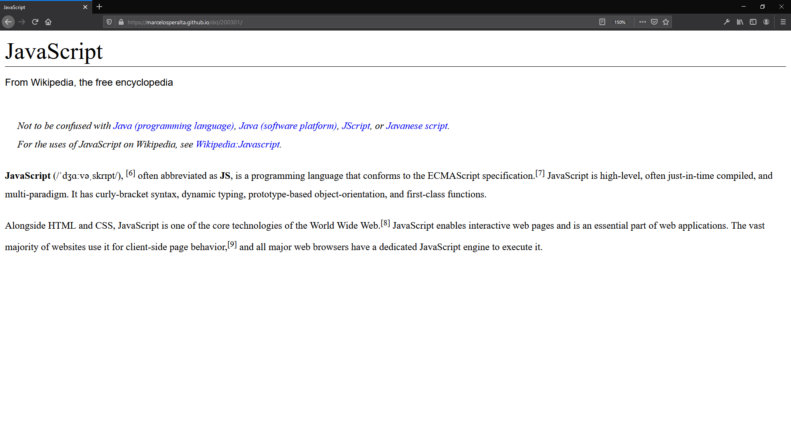

# HTML and CSS

### Exercise

Open your favorite wikipedia article and turn it into a HTML web page with correct headings and paragraphs where it is appropriate.

### Code

https://github.com/marcelosperalta/dci/blob/master/200301/index.html

https://github.com/marcelosperalta/dci/blob/master/200301/css/style.css

### Webpage

https://marcelosperalta.github.io/dci/200301/

