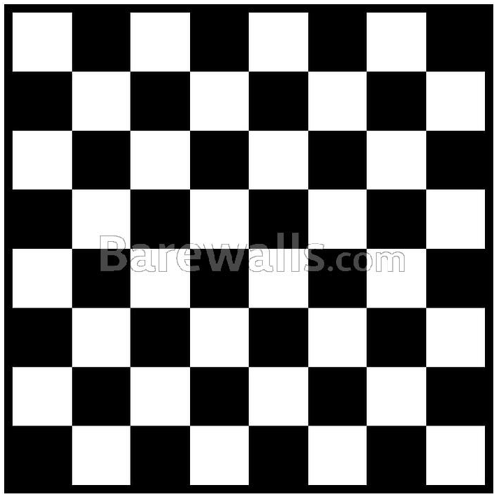

# HTML and CSS

### Exercise

This exercise should be done using Table and no Class or ID and your css file should not be more than 25 lines.

### Table

https://developer.mozilla.org/en-US/docs/Web/HTML/Element (Table content)

### Articles

http://learnlayout.com/toc.html

### Code

https://github.com/marcelosperalta/dci/blob/master/200306/index.html

https://github.com/marcelosperalta/dci/blob/master/200306/css/style.css