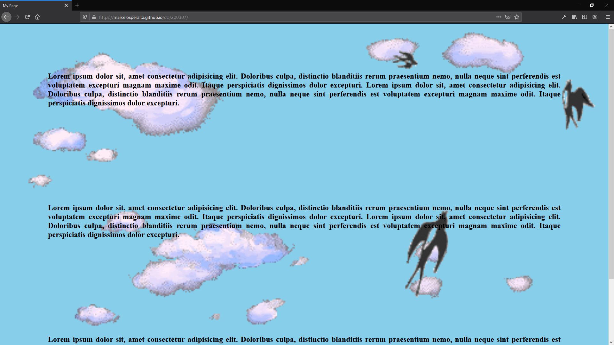

# HTML and CSS

### Exercise

**Sky**  
Build a webpage that will give the feeling to the user that he/she is in the sky
and remember that in the sky you will find some birds flying and many clouds.
Keep on mind that your clouds will move around and for sure the birds do that too.
The user should see that when he/she browsing this webpage.

### Code

https://github.com/marcelosperalta/dci/blob/master/200307/index.html

https://github.com/marcelosperalta/dci/blob/master/200307/css/style.css

### Webpage

https://marcelosperalta.github.io/dci/200307/

