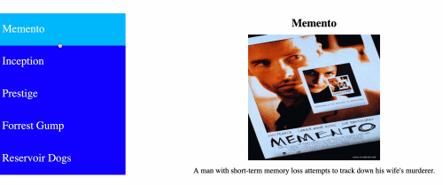

# DOM (Document Object Model)

https://developer.mozilla.org/de/docs/DOM  
https://www.w3.org/TR/REC-DOM-Level-1/introduction.html

## Event bubbling and capture

https://developer.mozilla.org/en-US/docs/Learn/JavaScript/Building_blocks/Events#Event_bubbling_and_capture

## .removeChild()

https://developer.mozilla.org/de/docs/Web/API/Node/removeChild

## .classList

https://developer.mozilla.org/en-US/docs/Web/API/Element/classList

# Javascript 

## Reserved keywords as of ECMAScript 2015

https://developer.mozilla.org/en-US/docs/Web/JavaScript/Reference/Lexical_grammar#Keywords

# Exercise

## Dynamic Pills

Description:

* There should be visual feedback while hovering over the list items. Example: The list item's background color should change to blue on hover;
* On click, the title, image and move description should update on the left side of the list items;
* On click, the list item should also be displayed with a different background color, e.g. red.

Instructions:

* Uplode your favorite movie images and create your own design, write a function that adds and handles the dynamic pill behaviour;
* Deploy this page on Github Pages.

Hint:
* Refer to the representation below, for an idea of what your result should look like.

