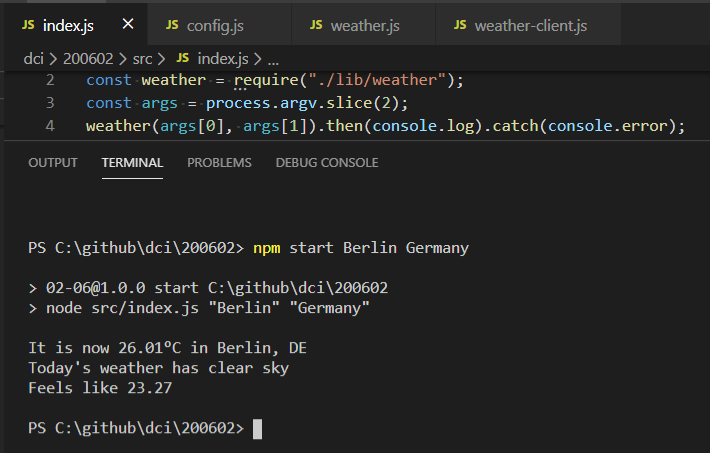

# Node.js

https://nodejs.org/en/  

## url.resolve(from, to)

https://nodejs.org/docs/latest/api/url.html#url_url_resolve_from_to

# OpenWeather API

https://openweathermap.org/  

## Current weather data

https://openweathermap.org/current

# Creating a package.json file

- to create package.json  

```
npm init
```

https://docs.npmjs.com/creating-a-package-json-file  

- to create package-lock.json

```
npm install
```

https://docs.npmjs.com/configuring-npm/package-locks.html

## chmod

https://en.wikipedia.org/wiki/Chmod  

## npm link

https://docs.npmjs.com/cli/link  

## npm unlink

https://www.npmjs.com/package/unlink  

## nodemon

npm install nodemon  

https://www.npmjs.com/package/nodemon  

## axios

npm install axios  

https://www.npmjs.com/package/axios  

## A guide to creating a NodeJS command-line package

https://medium.com/netscape/a-guide-to-create-a-nodejs-command-line-package-c2166ad0452e

# Recapitulation

## getter

https://developer.mozilla.org/en-US/docs/Web/JavaScript/Reference/Functions/get

## setter

https://developer.mozilla.org/en-US/docs/Web/JavaScript/Reference/Functions/set

# Screenshot

