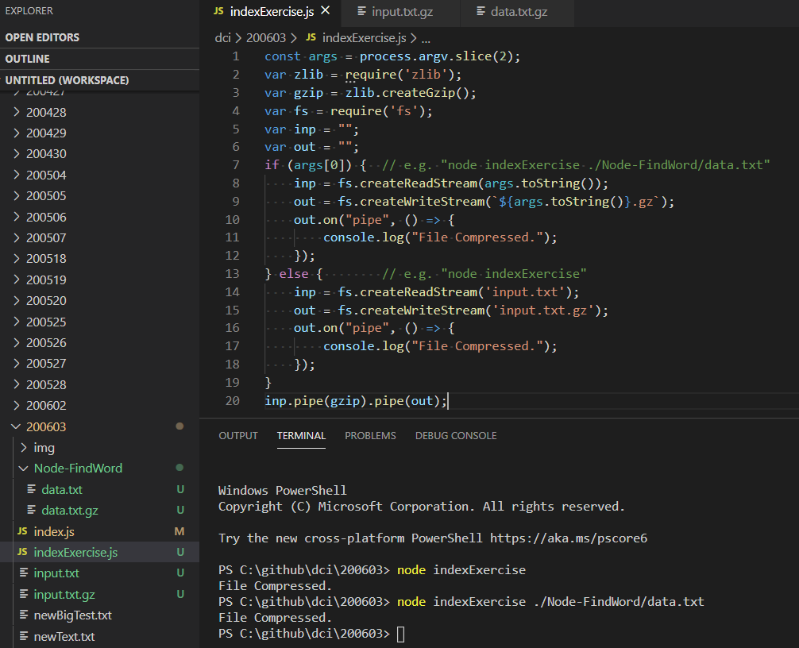
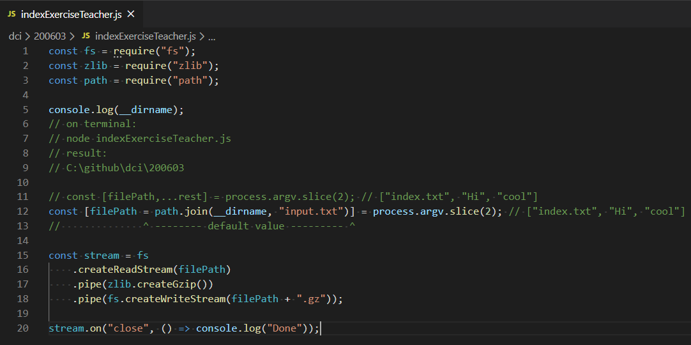

# Node.js

https://nodejs.org/en/  

## Stream

https://nodejs.org/api/stream.html#stream_stream  

### Node’s Streams - What Exactly Are Streams?

https://jscomplete.com/learn/node-beyond-basics/node-streams#what-exactly-are-streams  

### Node.js Streams: Everything you need to know

https://www.freecodecamp.org/news/node-js-streams-everything-you-need-to-know-c9141306be93/

## pipe

https://nodejs.org/api/stream.html#stream_event_pipe  

## fs (File System)

https://nodejs.org/api/fs.html#fs_file_system  

### File System Flags

https://nodejs.org/docs/latest-v12.x/api/fs.html#fs_file_system_flags  

### fs.createWriteStream(path[, options])

https://nodejs.org/api/fs.html#fs_fs_createwritestream_path_options  

### fs.createReadStream(path[, options])

https://nodejs.org/api/fs.html#fs_fs_createreadstream_path_options  

# Glossary

## Stream (computing)

In computer science, a stream is a sequence of data elements made available over time. A stream can be thought of as items on a conveyor belt being processed one at a time rather than in large batches.  

https://en.wikipedia.org/wiki/Stream_(computing)

## Streaming data

Streaming data is data that is continuously generated by different sources. Such data should be processed incrementally using Stream Processing techniques without having access to all of the data. In addition, it should be considered that concept drift may happen in the data which means that the properties of the stream may change over time.  

https://en.wikipedia.org/wiki/Streaming_data

## Composability

Composability is a system design principle that deals with the inter-relationships of components. A highly composable system provides components that can be selected and assembled in various combinations to satisfy specific user requirements.  

https://en.wikipedia.org/wiki/Composability

# Screenshot


# Exercise

## Compress File

Create a program to compress files.

The program should compress any file into a [**gzip**](https://www.gnu.org/software/gzip/) archive and notify the user of success.

- Make sure to create `index.js`, and to create your program you should use `createReadStream`, 
`pipe` and the [`zlib`](https://www.npmjs.com/package/zlib) library.
- In this repository you will find a file `input.txt` that would have to be compressed by your program
into `input.txt.gz` by default (if not file path has been provided).

```bash
$ node index
File Compressed.
```
- After you have executed `index.js` you should be able to see 
on your program folder the new compressed file `input.txt.gz`.

- The program should also be able to compress files 
from other folders if you pass a path as an argument. 

For example:

```bash
$ node index ./Node-FindWord/data.txt
File Compressed.
```
- After you have executed the program that way 
you should be able to see in the `Node-FindWord` folder the new compressed file `data.txt.gz`.

## Code

https://github.com/marcelosperalta/dci/blob/master/200603/indexExercise.js

## Screenshot

### **My solution:**



### **Teacher's solution:**



## Resource

### zlib (npm)

https://www.npmjs.com/package/zlib

### zlib (Read the Docs)

https://node.readthedocs.io/en/latest/api/zlib/

### zlib (Node.js)

https://nodejs.org/api/zlib.html#zlib_zlib

#### zlib.createGzip([options])

https://nodejs.org/dist/latest-v12.x/docs/api/zlib.html#zlib_zlib_creategzip_options

### Path

https://nodejs.org/api/path.html#path_path

### __dirname

https://nodejs.org/docs/latest/api/globals.html#globals_dirname

### Event: 'close'

https://nodejs.org/api/stream.html#stream_event_close