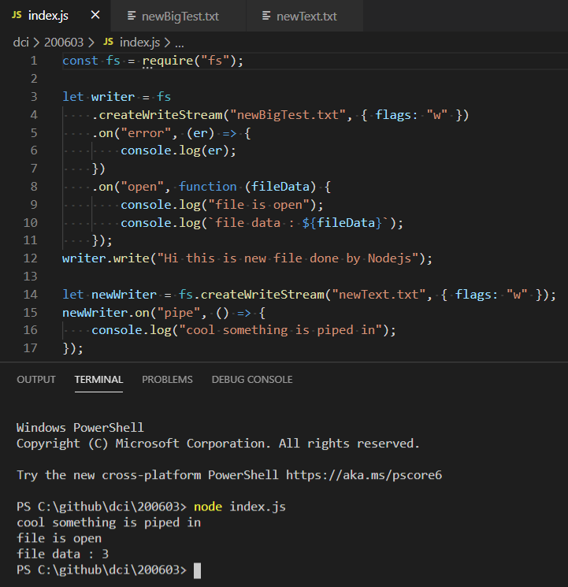

# Node.js

https://nodejs.org/en/  

## Stream

https://nodejs.org/api/stream.html#stream_stream  

### Node’s Streams - What Exactly Are Streams?

https://jscomplete.com/learn/node-beyond-basics/node-streams#what-exactly-are-streams  

## pipe

https://nodejs.org/api/stream.html#stream_event_pipe  

## fs (File System)

https://nodejs.org/api/fs.html#fs_file_system  

### File System Flags

https://nodejs.org/docs/latest-v12.x/api/fs.html#fs_file_system_flags  

### fs.createWriteStream(path[, options])

https://nodejs.org/api/fs.html#fs_fs_createwritestream_path_options  

### fs.createReadStream(path[, options])

https://nodejs.org/api/fs.html#fs_fs_createreadstream_path_options  

# Glossary

## Stream (computing)

In computer science, a stream is a sequence of data elements made available over time. A stream can be thought of as items on a conveyor belt being processed one at a time rather than in large batches.  

https://en.wikipedia.org/wiki/Stream_(computing)

## Streaming data

Streaming data is data that is continuously generated by different sources. Such data should be processed incrementally using Stream Processing techniques without having access to all of the data. In addition, it should be considered that concept drift may happen in the data which means that the properties of the stream may change over time.  

https://en.wikipedia.org/wiki/Streaming_data

# Screenshot

