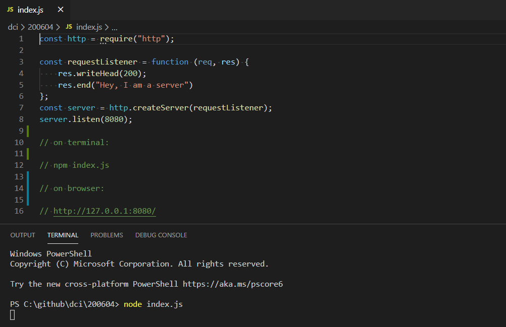
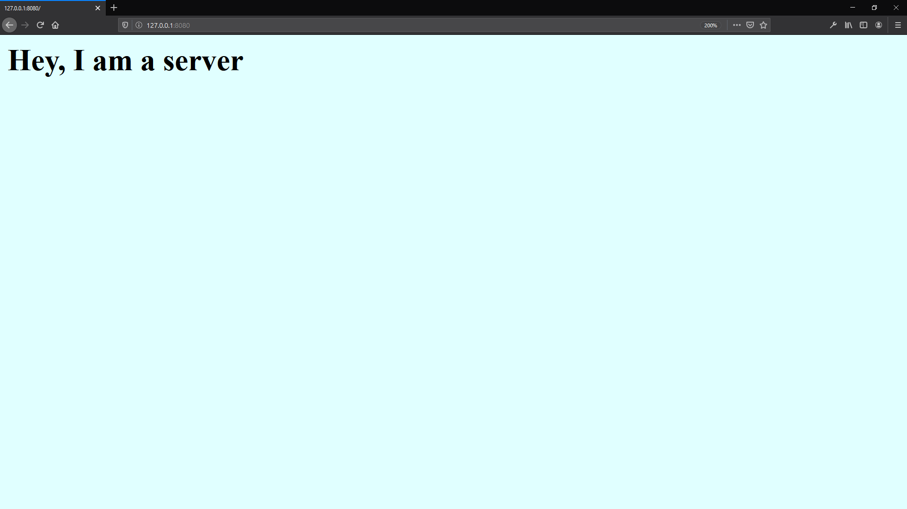

# Node.js

https://nodejs.org/en/  

## HTTP

https://nodejs.org/api/http.html#http_http

### http.createServer([options][, requestListener])

https://nodejs.org/api/http.html#http_http_createserver_options_requestlistener

## zlib (Node.js)

https://nodejs.org/api/zlib.html#zlib_zlib

### zlib.createGzip([options])

https://nodejs.org/dist/latest-v12.x/docs/api/zlib.html#zlib_zlib_creategzip_options

## Path

https://nodejs.org/api/path.html#path_path

## __dirname

https://nodejs.org/docs/latest/api/globals.html#globals_dirname

# env

https://man7.org/linux/man-pages/man1/env.1.html

# A guide to creating a NodeJS command-line package

https://medium.com/netscape/a-guide-to-create-a-nodejs-command-line-package-c2166ad0452e

# How to publish packages to npm (the way the industry does things)

https://zellwk.com/blog/publish-to-npm/

# Screenshot

**Terminal**

**Browser**

