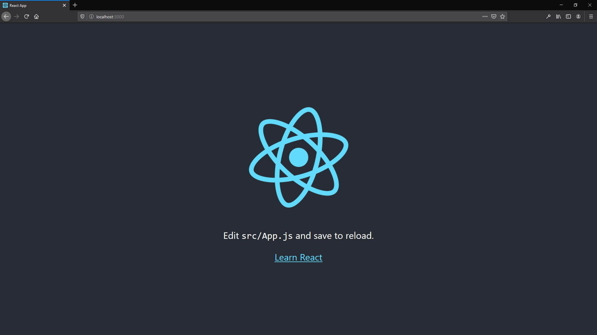
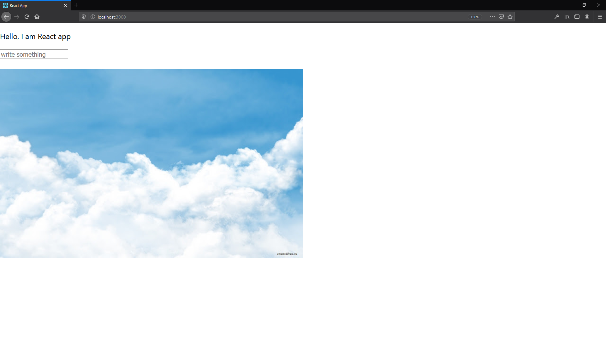

# MVC (Model–view–controller)

https://en.wikipedia.org/wiki/Model%E2%80%93view%E2%80%93controller  

## MVC Architecture & Its Benefits in Web Application Development

https://techaffinity.com/blog/mvc-architecture-benefits-of-mvc/

# npx

https://www.npmjs.com/package/npx  

# React

https://reactjs.org/  

## Getting Started

https://reactjs.org/docs/getting-started.html  

### Create a New React App

https://reactjs.org/docs/create-a-new-react-app.html  

```
npx create-react-app first-app
```

### ".../first-app"

```
npm run build
```

# Add a web app manifest

https://web.dev/add-manifest/

# Create React App

https://create-react-app.dev/

# Screenshot

## Original:



## Modified:


