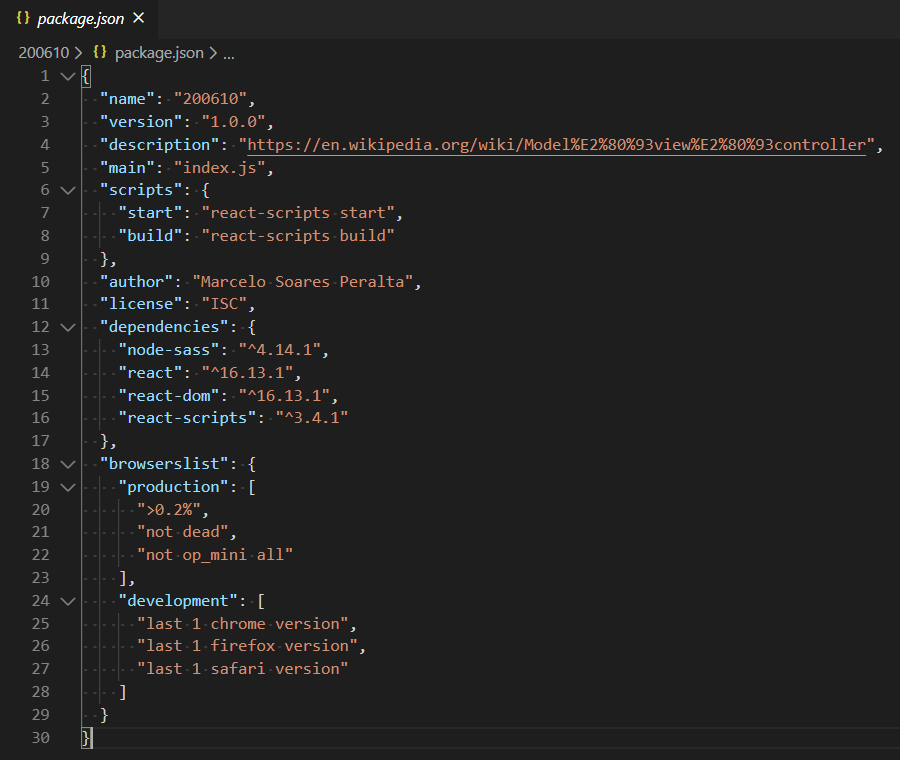
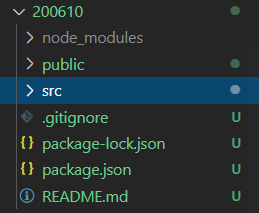
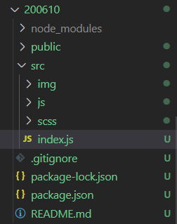
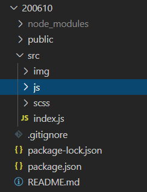
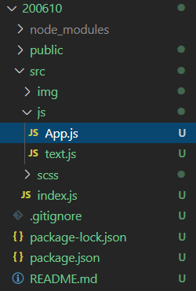
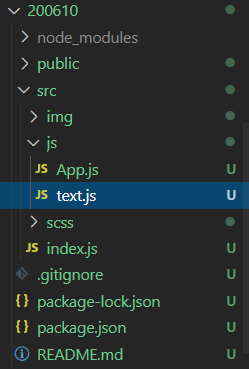
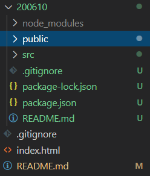
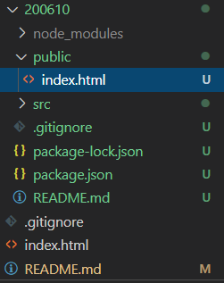
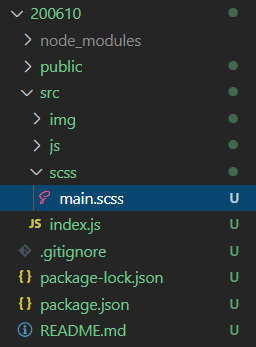
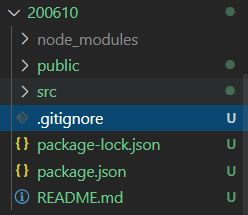

# single-page application (SPA)

https://en.wikipedia.org/wiki/Single-page_application  

# React

https://reactjs.org/  

# My first React App

**Steps:**

**1. create "package.json"**
```
npm init
```

**2. install React**
```
npm i react
```

**3. install React DOM**
```
npm i react-dom
```

**4. install React Scripts**
```
npm i react-scripts
```

**5. add on "package.json"**
```
{
 ...
  "scripts": {
    "start": "react-scripts start",
    "build": "react-scripts build"
  },
  ...
}
```



**6. install Sass**
```
npm i node-sass --save
```

**7. create "src" folder**



**8. create "index.js" inside "src" folder with the code below**

- file:



- code:

```
import React from "react";
import ReactDOM from "react-dom";
import App from "./js/App";
import "./scss/main.scss";

ReactDOM.render(
    <React.StrictMode>
        <App />
    </React.StrictMode>,
    document.getElementById("root")
);
```

**9. create "js" folder inside "src" folder**



**10. create "App.js" file inside "js" folder with the code below**

- file:



- code:

```
import React from "react";
import Text from "./text";

const App = () => {
    return (
        <div>
            <h1>Hi, I am React</h1>
            <Text />
            <Text />
            <Text />
        </div>
    );
};

export default App;
```

**11. create "text.js" file inside "js" folder with the code below**

- file:



- code:

```
import React from "react";

const Text = () => {
    return (
        <div>
            <p>This is text</p>
        </div>
    )
}

export default Text;
```

**12. create "public" folder**



**13. create "index.html" file inside "public" folder with the code below**

- file:



- code:

```
<!DOCTYPE html>
<html lang="en">

<head>
    <meta charset="UTF-8">
    <meta name="viewport" content="width=device-width, initial-scale=1.0">
    <title>React App</title>
</head>

<body>
    <div id="root"></div>
</body>

</html>
```

**or**

type "!" and press "Enter";

```
!
```

change the title and add the line below inside body.

```
<div id="root"></div>
```

**14. create "scss" folder inside "src" folder**


**15. create "main.scss" file inside "scss" folder with some style like the code below**

- file:



- code:

```
body {
    display: flex;
    justify-content: center;
    align-items: center;
    background-color: lightblue;
}
```

**16. create ".gitignore" file with the code below**

- file:



- code:

```
/node_modules
```

**17. run react app**

```
npm start
```

Screenshoot:

