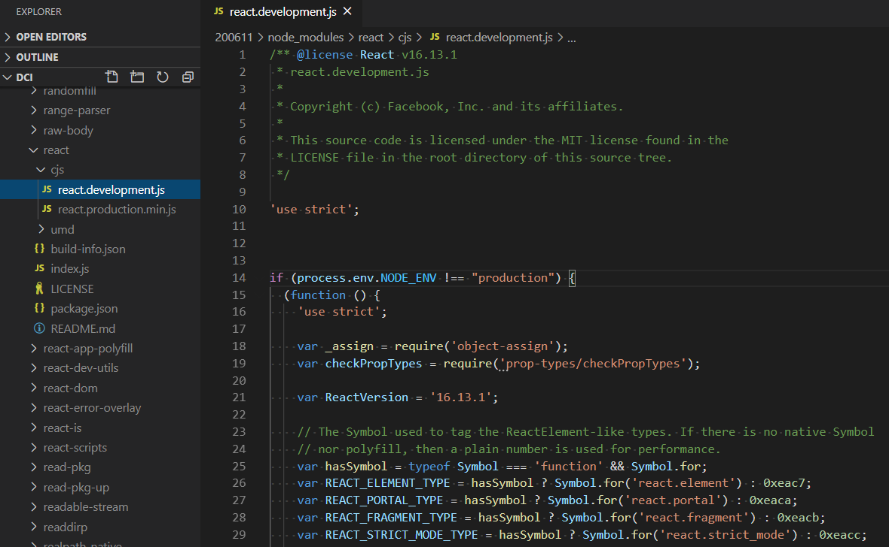

# React

https://reactjs.org/  

## Google Chrome extension "React Developer Tools"

https://chrome.google.com/webstore/detail/react-developer-tools/fmkadmapgofadopljbjfkapdkoienihi?hl=en

## Fragments

https://reactjs.org/docs/fragments.html

## JSX

https://reactjs.org/docs/introducing-jsx.html

## render()

https://reactjs.org/docs/react-dom.html#render

## Components and Props

https://reactjs.org/docs/components-and-props.html

## react.development.js



# Screenshots


# Exercise

**To-do-list with React**

- The user should have the ability to add a items list (listItem) through the input field;

- The list of all items (listOfAllItems) should be displayed for the user.

Reference:

https://github.com/FBw-26/live-coding/blob/master/apr/22-04/index.js

Solution:

- code:

```

```

- screeshot:

