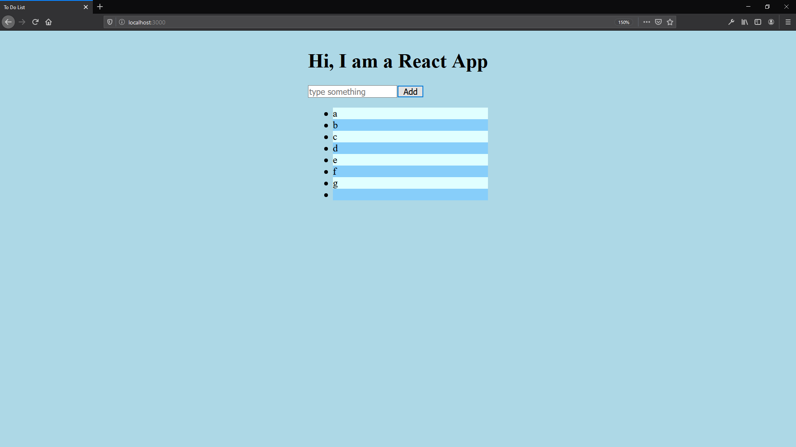

# MDN Web Docs Glossary: Definitions of Web-related terms

https://developer.mozilla.org/en-US/docs/Glossary

# React

https://reactjs.org/

## State

https://reactjs.org/docs/state-and-lifecycle.html

## VS Code ES7 React/Redux/React-Native/JS snippets

https://marketplace.visualstudio.com/items?itemName=dsznajder.es7-react-js-snippets

# Exercise "to-do list"

## Screenshots

