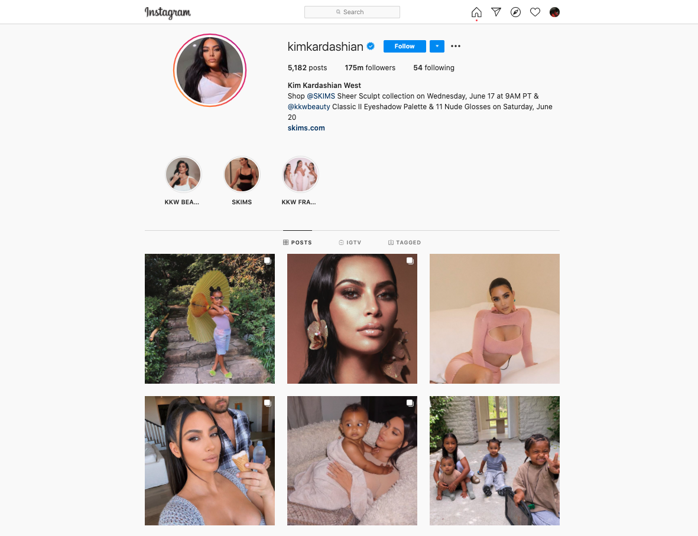

# React

https://reactjs.org/

## Function

https://reactjs.org/docs/components-and-props.html#function-and-class-components

## React Bootstrap

https://react-bootstrap.github.io/  

https://react-bootstrap.github.io/getting-started/introduction

```
npm i react-bootstrap bootstrap
```

## How to Use Sass and Styled Components in a React JS Application

https://www.iamtimsmith.com/blog/how-to-use-styles-in-a-react-js-application/

# Exercise "Instagram mock-up"

- Build your own **data.json** which contains all the information about posts;
- Use **Sass** for this build;
- Feel free to have any other artist or celebrity or even own your photos;
- Consider that you have to use **props** and pass data to components;
- Create repo and send me the link in private message.

