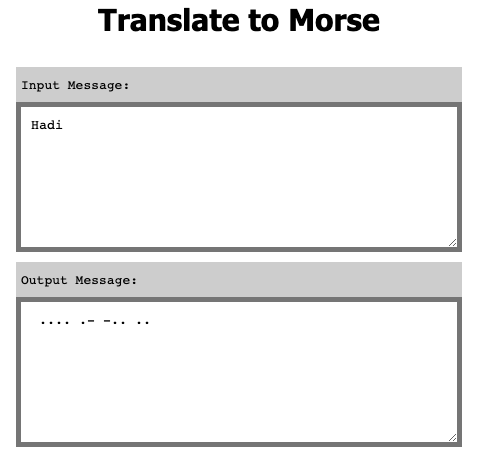

# React

https://reactjs.org/

## State

https://reactjs.org/docs/state-and-lifecycle.html

### How to deploy your React app into Github Pages

https://blog.usejournal.com/how-to-deploy-your-react-app-into-github-pages-b2c96292b18e

### How to deploy React App to GitHub Pages

https://dev.to/yuribenjamin/how-to-deploy-react-app-in-github-pages-2a1f

# Exercise "Morse translator"

- Your App should translate any given text into morse code;
- These symbols are not available: "§", "^", "~", "€", "{", "}", "[", "]", ">", and "<".

## Screenshot

