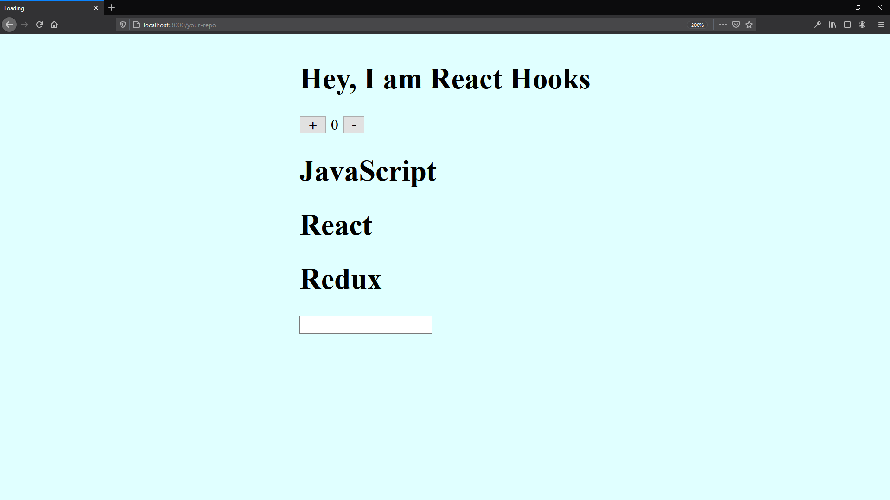

# React

https://reactjs.org/

## Snippet

https://en.wikipedia.org/wiki/Snippet_(programming)

### ES7 React/Redux/GraphQL/React-Native snippets

https://marketplace.visualstudio.com/items?itemName=dsznajder.es7-react-js-snippets

### Simple React Snippets

https://marketplace.visualstudio.com/items?itemName=burkeholland.simple-react-snippets

# Hooks

https://reactjs.org/docs/hooks-intro.html

# Important steps to run the app

1. create **package.json**

```
npm init
```

- [npm init documentantion](https://docs.npmjs.com/cli/init)

\
2. install **package.json** dependencies (will generate **node_modules** folder)

```
npm install
```

- [npm install documentantion](https://docs.npmjs.com/cli/install)

You can install after that whatever dependencies you want. e.g.

```
npm i redux
```
The command above will install [redux](https://redux.js.org/) on **node_modules** and add to the **package.json** dependencies  

- [npm redux documentantion](https://www.npmjs.com/package/redux)

\
3. to run the app

```
npm start
```
- [npm start documentantion](https://docs.npmjs.com/cli/start.html)

## Screenshot



## Exercise "To-do list with Hooks"

- Refactoring our To-do list into React Hooks;
- Do your modification into other branch on the To-do list repo.

# React Recap

## Screenshot

