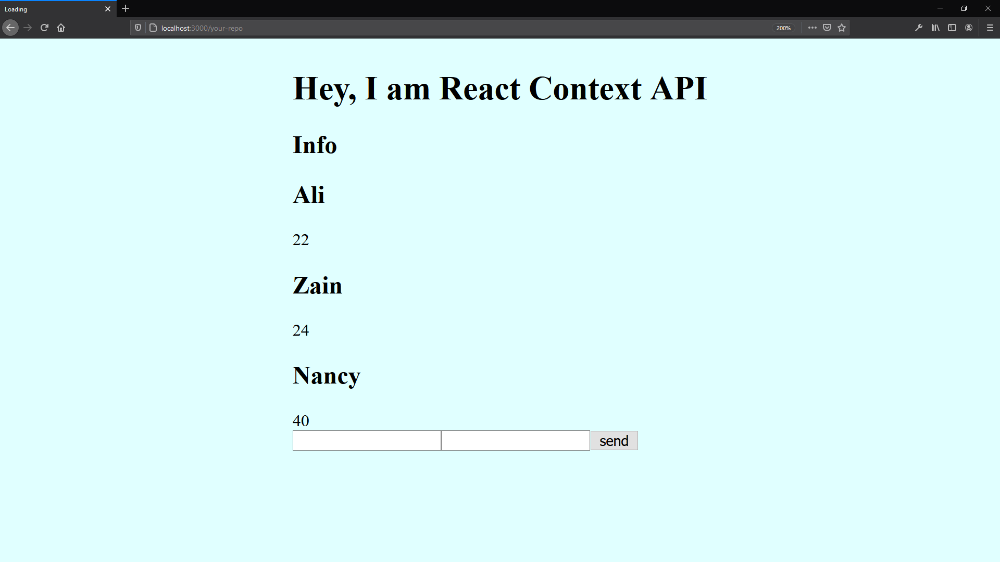

# React

https://reactjs.org/

## Context

https://reactjs.org/docs/context.html#reactcreatecontext

### React.createContext

https://reactjs.org/docs/context.html#reactcreatecontext

## Hooks

https://reactjs.org/docs/hooks-intro.html

### Learn the basics of React Hooks in <10 minutes

https://www.freecodecamp.org/news/learn-the-basics-of-react-hooks-in-10-minutes-b2898287fe5d/

### React.js Hooks Crash Course

https://www.youtube.com/watch?v=-MlNBTSg_Ww

# Important steps to run the app

1. create **package.json**

```
npm init
```

- [npm init documentantion](https://docs.npmjs.com/cli/init)

\
2. install **package.json** dependencies (will generate **node_modules** folder)

```
npm install
```

- [npm install documentantion](https://docs.npmjs.com/cli/install)

You can install after that whatever dependencies you want. e.g.

```
npm i redux
```
The command above will install [redux](https://redux.js.org/) on **node_modules** and add to the **package.json** dependencies  

- [npm redux documentantion](https://www.npmjs.com/package/redux)

\
3. to run the app

```
npm start
```
- [npm start documentantion](https://docs.npmjs.com/cli/start.html)

## Screenshot



## Exercise "Online Shop with React Hooks"

- Refactoring our Online Shop into React Hooks (useState, useContext);
- Do your modification into other branch on the Online Shop repo.