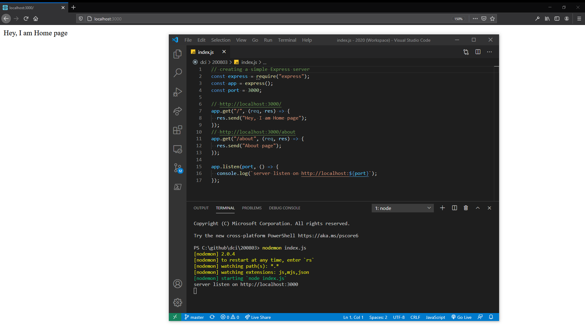
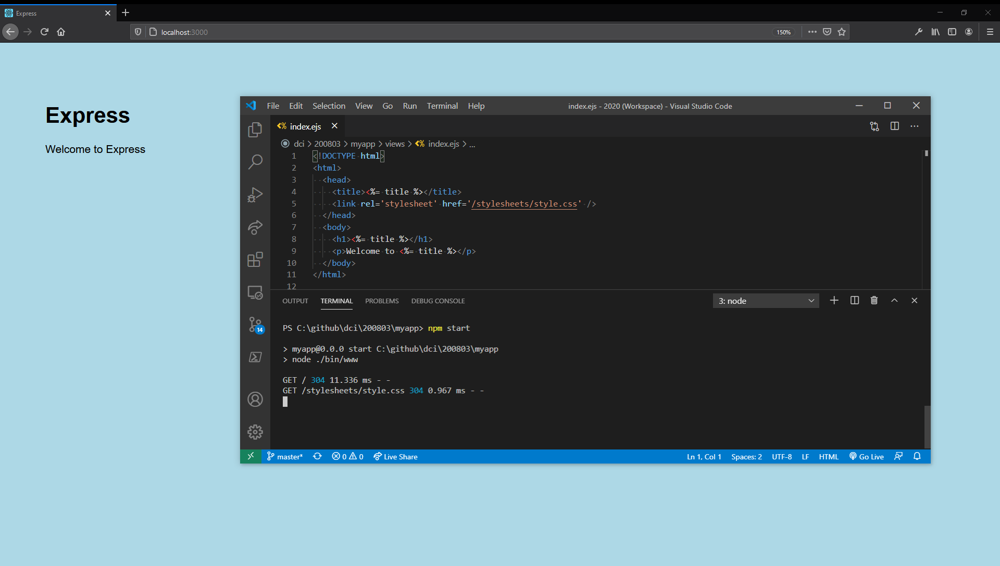

# Express

https://expressjs.com/

## Installing

https://expressjs.com/en/starter/installing.html

```
npm init -y
```

```
npm i express --save
```

## Starting

```
nodemon index.js
```

## Screenshot



### Installing Express application generator

http://expressjs.com/en/starter/generator.html

Use the application generator tool, express-generator, to quickly create an application skeleton.

```
npm install -g express-generator
```

```
express -help
```

```
express --ejs myapp
```

#### Install dependencies

```
npm install
```

#### Run the App

```
npm start
```

*in the browser:*

http://localhost:3000/

#### Screenshot



# Client/Server architecture

https://www.setthings.com/en/clientserver-architecture/

# How HTTP/1 works

https://cascadingmedia.com/insites/2015/03/http-2.html

# HTTP

## HTTP response status codes

https://developer.mozilla.org/en-US/docs/Web/HTTP/Status

## HTTP request methods

https://developer.mozilla.org/en-US/docs/Web/HTTP/Methods

# Tutorials

[Traversy Media - Express JS Crash Course](https://www.youtube.com/watch?v=L72fhGm1tfE&feature=youtu.be)

[The Coding Train - 8.2: HTTP Server with Express - Programming with Text](https://www.youtube.com/watch?v=6oiabY1xpBo&feature=youtu.be)