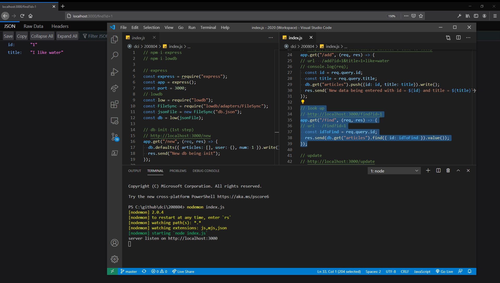

# Express

https://expressjs.com/

## Installing

https://expressjs.com/en/starter/installing.html

```
npm init -y
```

```
npm i express
```

## Starting

```
nodemon index.js
```

## Screenshot



# Lowdb

https://github.com/typicode/lowdb

Small JSON database for Node, Electron and the browser. Powered by Lodash.

## Installing

https://www.npmjs.com/package/lowdb

```
npm i lowdb
```

# db-mock

https://www.npmjs.com/package/db-mock