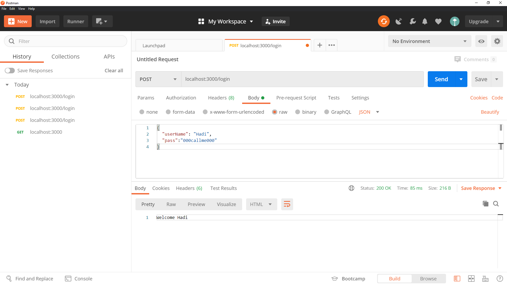
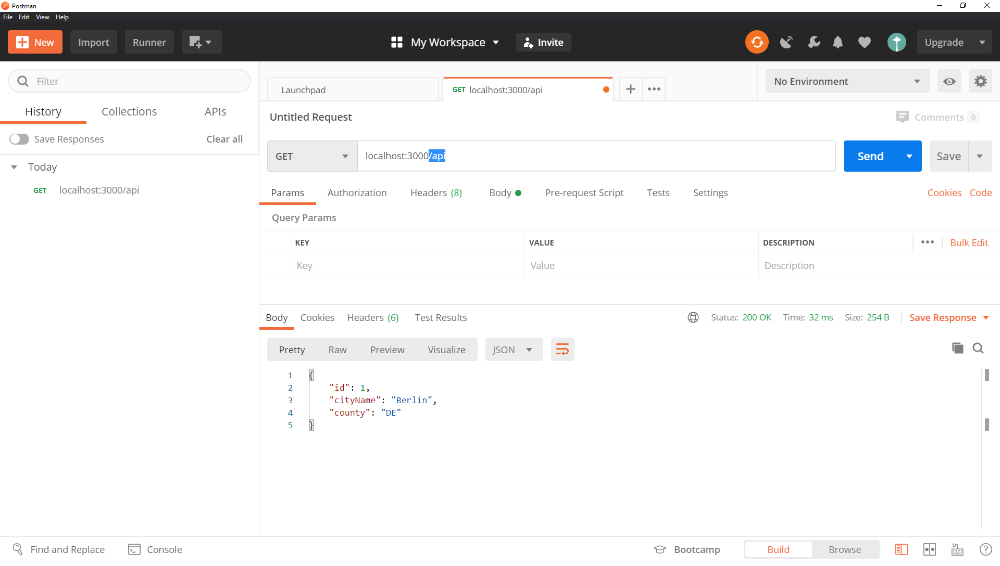
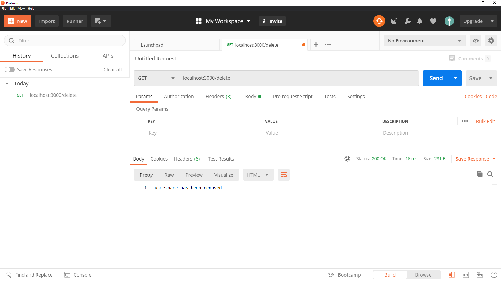

# Express

https://expressjs.com/

Fast, unopinionated, minimalist web framework for Node.js

## Installing

https://expressjs.com/en/starter/installing.html

```
npm init -y
```

```
npm i express
```

# Lowdb

https://github.com/typicode/lowdb

Small JSON database for Node, Electron and the browser. Powered by Lodash.

## Installing

https://www.npmjs.com/package/lowdb

```
npm i lowdb
```

## Starting

```
nodemon index.js
```

# Postman

https://www.postman.com/

The Collaboration Platform for API Development

## Download

https://www.postman.com/downloads/

# Node.js

https://nodejs.org/

## process.env

https://nodejs.org/dist/latest-v12.x/docs/api/process.html#process_process_env

## Screenshots






