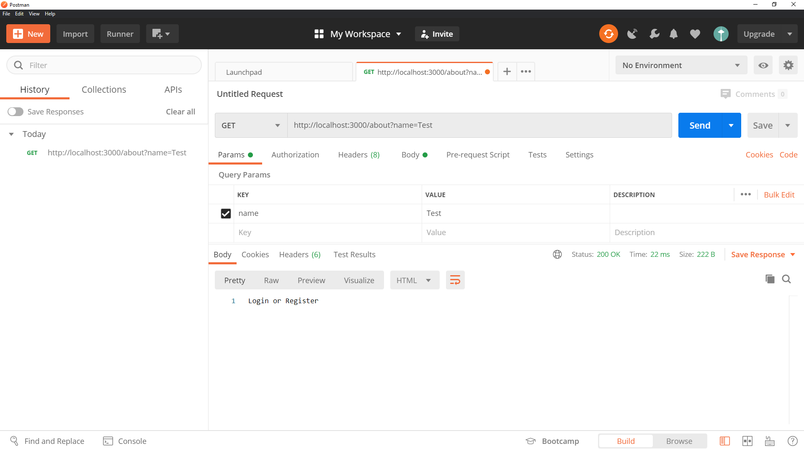

# Express

https://expressjs.com/

Fast, unopinionated, minimalist web framework for Node.js

## Installing

https://expressjs.com/en/starter/installing.html

```
npm init -y
```

```
npm i express
```

## Starting

```
nodemon index.js
```

## Using middleware

https://expressjs.com/en/guide/using-middleware.html  

## Express/Node introduction (MDN)

https://developer.mozilla.org/en-US/docs/Learn/Server-side/Express_Nodejs/Introduction

# Postman

https://www.postman.com/

The Collaboration Platform for API Development

## Download

https://www.postman.com/downloads/

# Screenshots

**url: /about?name=Hadi**  


**url: /about?name=Test**  

