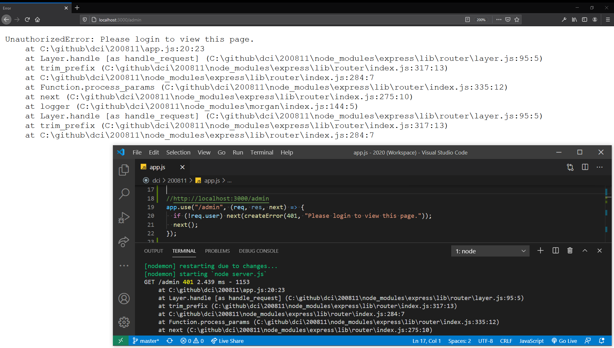
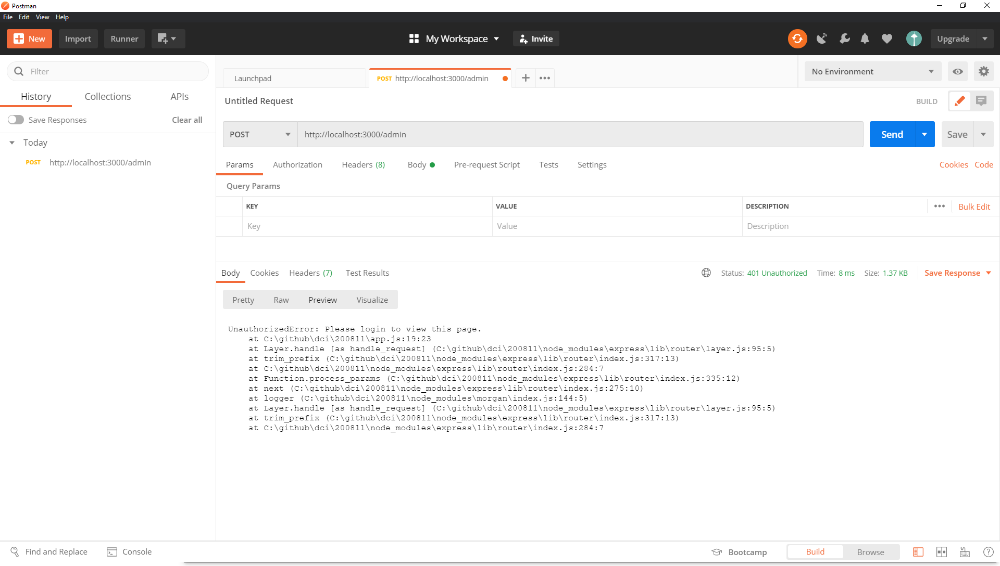
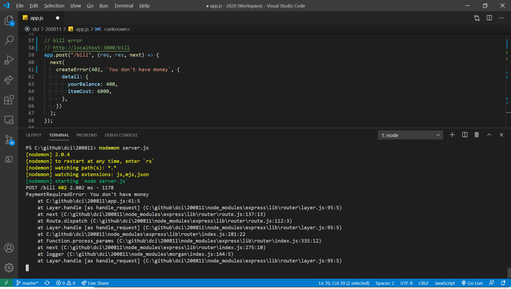
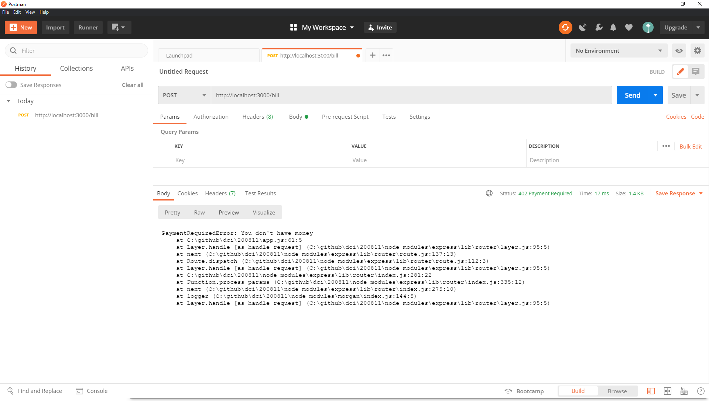

# Express

https://expressjs.com/

Fast, unopinionated, minimalist web framework for Node.js

## Installing

https://expressjs.com/en/starter/installing.html

```
npm init -y
```

```
npm i express
```

## Starting

```
nodemon server.js
```

http://localhost:3000/  

## Using middleware

https://expressjs.com/en/guide/using-middleware.html  

## Express/Node introduction (MDN)

https://developer.mozilla.org/en-US/docs/Learn/Server-side/Express_Nodejs/Introduction

## Express Tutorial Part 4: Routes and controllers

https://developer.mozilla.org/en-US/docs/Learn/Server-side/Express_Nodejs/routes

# morgan

https://github.com/expressjs/morgan#readme

## Installing

https://www.npmjs.com/package/morgan

```
npm i morgan
```

# router

https://github.com/pillarjs/router#readme

## Installing

https://www.npmjs.com/package/router

```
npm i router
```

# http

https://github.com/npm/security-holder#readme

## Installing

https://www.npmjs.com/package/http

```
npm i http
```

# http-errors

https://github.com/jshttp/http-errors#readme

## Installing

https://www.npmjs.com/package/http-errors

```
npm i http-errors
```

# Postman

https://www.postman.com/

The Collaboration Platform for API Development

## Download

https://www.postman.com/downloads/

# How to install dependencies based on _package.json_ file

```
npm install
```

# Screenshots

**url: /admin**  





**url: /bill**  



