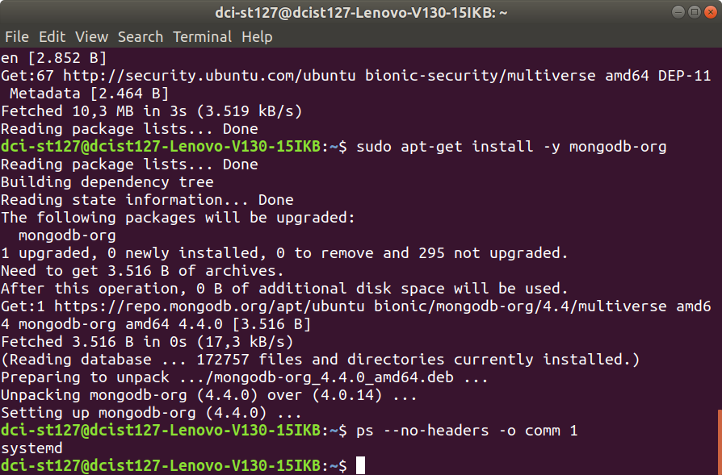
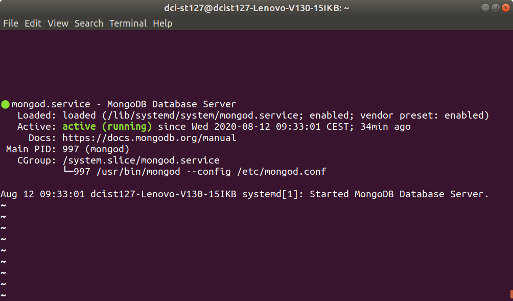
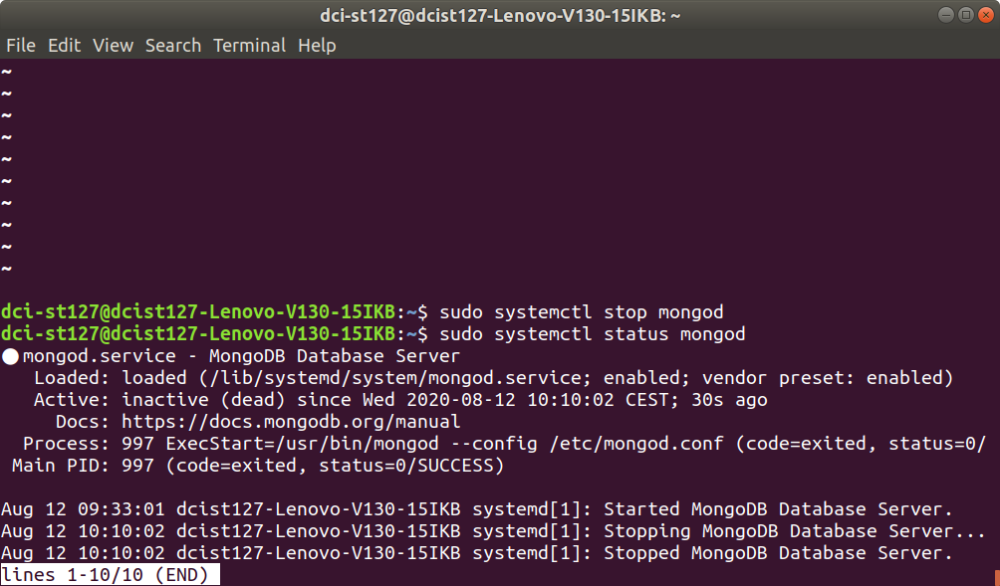
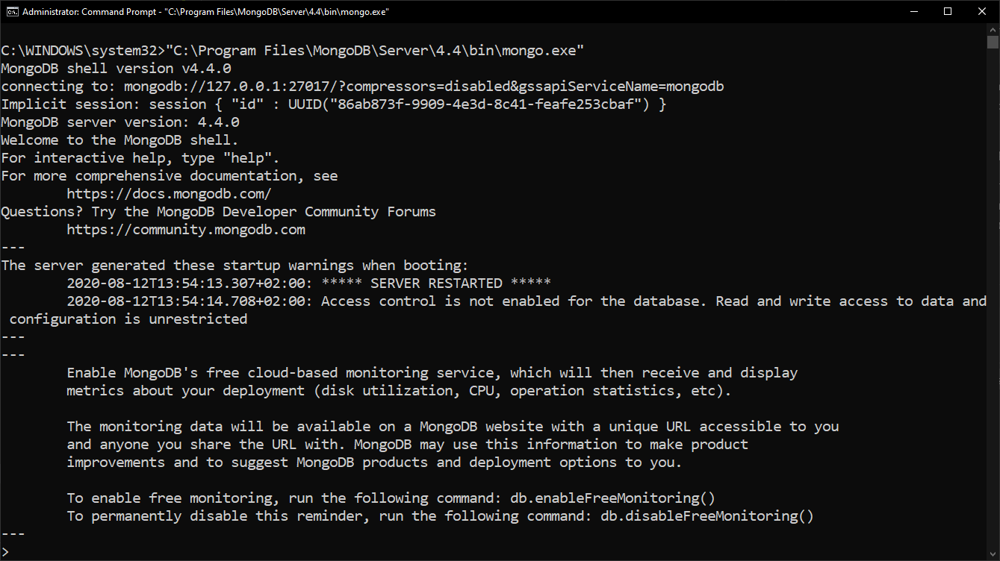

# Database

## SQL

https://en.wikipedia.org/wiki/SQL  

### PostgreSQL

https://www.postgresql.org/  

## NoSQL

https://en.wikipedia.org/wiki/NoSQL  

### MongoDB

https://www.mongodb.com/  

## NoSQL vs SQL Databases

https://www.mongodb.com/nosql-explained/nosql-vs-sql  
<br>

### Installation on Linux :penguin:

[Install MongoDB Community Edition on Linux](https://docs.mongodb.com/manual/administration/install-on-linux/)  

[Install MongoDB Community Edition on Ubuntu](https://docs.mongodb.com/manual/tutorial/install-mongodb-on-ubuntu/)  

**check**

```
ps --no-headers -o comm 1
```

e.g.  

_result:_ systemd



**run**

1. start

    ```
    sudo systemctl start mongod
    ```

2. verify

    ```
    sudo systemctl status mongod
    ```

    

3. stop  

    ```
    sudo systemctl stop mongod
    ```

    

4. stop  

    ```
    sudo systemctl restart mongod
    ```

5. stop  

    ```
    mongo
    ```

6. documentation:  

    mongo  
    https://docs.mongodb.com/manual/reference/program/mongo/#bin.mongo  

    The mongo Shel  
    https://docs.mongodb.com/manual/mongo/  

    Getting Started  
    https://docs.mongodb.com/manual/tutorial/getting-started/#getting-started  
<br>

### Installation on Windows :rainbow:

[Install MongoDB Community Edition on Windows](https://docs.mongodb.com/manual/tutorial/install-mongodb-on-windows/)  

1. download 

    https://www.mongodb.com/try/download/community?tck=docs_server  

2. run the installer

    double-click the .msi file.  

3. follow the installation wizard

    e.g.

    choosing "Complete"

    choosing "as a Windows service"

4. to begin using

- From Windows Explorer/File Explorer, go to C:\Program Files\MongoDB\Server\4.4\bin\ directory and double-click on mongo.exe.  

or  

-  open a Command Interpreter with Administrative privileges and run:

```
"C:\Program Files\MongoDB\Server\4.4\bin\mongo.exe"
```

5. For information on CRUD (Create,Read,Update,Delete) operations, see:

    * [Insert Documents](https://docs.mongodb.com/manual/tutorial/insert-documents/)  

    * [Query Documents](https://docs.mongodb.com/manual/tutorial/query-documents/)  

    * [Update Documents](https://docs.mongodb.com/manual/tutorial/update-documents/)  

    * [Delete Documents](https://docs.mongodb.com/manual/tutorial/remove-documents/)  

6. Run MongoDB Community Edition from the Command Interpreter  

    :rotating_light:  **IMPORTANT**  :rotating_light:

    _You must open the command interpreter as an Administrator._

* Create database directory

    ```
    cd C:\
    ```

    ```
    md "\data\db"
    ```
    
* Start your database

    ```
    cd C:\Program Files\MongoDB\Server\4.4\bin\
    ```

    ```
    mongod.exe --dbpath="c:\data\db"
    ```

    If the MongoDB database server is running correctly, the Command Interpreter displays:  

    **[initandlisten] waiting for connections**  

    

    

* Connect to MongoDB

    To connect a mongo.exe shell to the MongoDB instance, open another Command Interpreter with :warning: Administrative privileges :warning: and run:

    ````
    "C:\Program Files\MongoDB\Server\4.4\bin\mongo.exe"
    ````

    