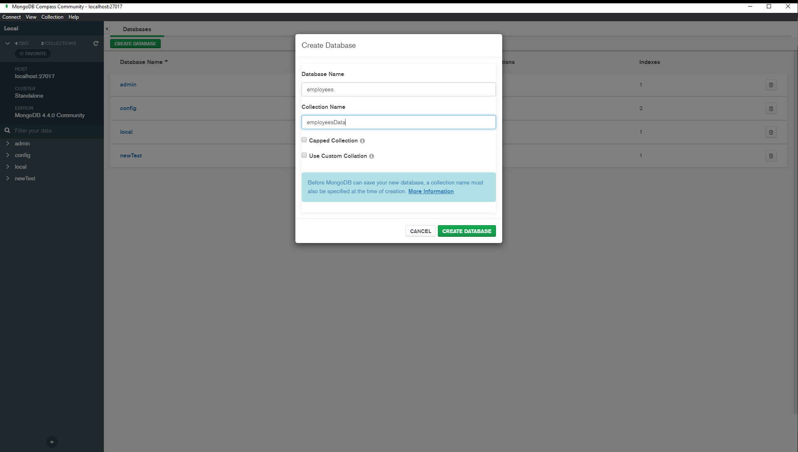
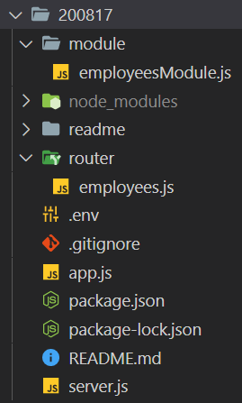
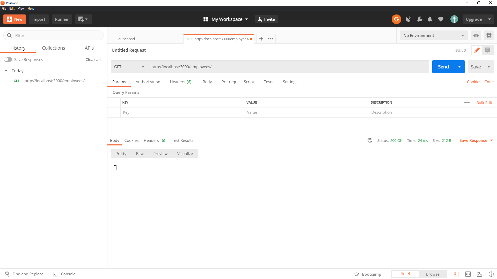

# MongoDB

## run (Windows 10)

Run MongoDB Community Edition from the Command Interpreter<br><br>

:rotating_light:  **IMPORTANT**  :rotating_light:

_You must open the command interpreter as an Administrator._

<br>

**Create database directory**

```
cd C:\
```

```
md "\data\db"
```
<br>

**Start your database**

```
cd C:\Program Files\MongoDB\Server\4.4\bin\
```

```
mongod.exe --dbpath="c:\data\db"
```

If the MongoDB database server is running correctly, the Command Interpreter displays:  

**[initandlisten] waiting for connections**  


<br><br>

**Connect to MongoDB**

To connect a mongo.exe shell to the MongoDB instance, open another Command Interpreter with :warning: Administrative privileges :warning: and run:

````
"C:\Program Files\MongoDB\Server\4.4\bin\mongo.exe"
````


<br>

**Create a empty Database using MongoDB Compass Community**




# Connection with MongoDB using JavaScript, Node.js, Express, Mongoose and Dotenv

## Installing the project based on existing ```package.json```

```
npm install
```
or  

:dvd: Create a new ```package.json```

```
git init -y
```

:dvd: Install [Express](https://expressjs.com/)

```
npm i express
```

:dvd: Install []()

```
npm i 
```

:dvd: Install []()

```
npm i 
```
:dvd: Install []()

```
npm i 
```
:dvd: Install []()

```
npm i 
```

:page_facing_up: Create an ```.env``` file and add the lines below

```
PORT=3000
DB_URL=mongodb://localhost:27017/employees
```

<div align="center">:rotating_light: :rotating_light: :rotating_light: :rotating_light: :rotating_light:</div>
<div align="center">The <code>.env<code> was not added to the <code>.gitignore<code> because this is a repository for study.<br>
In a company envirorment, never push this type of file to a repository like GitHub (or any other version control systems).:</div>
<div align="center">:rotating_light: :rotating_light: :rotating_light: :rotating_light: :rotating_light:</div>

:page_facing_up: Create an ```.gitignore``` file and add the line below

```
node_modules
```


Start

````
npm start
````


# Database

## SQL (Structured Query Language)

https://en.wikipedia.org/wiki/SQL  

## NoSQL (originally referring to "non-SQL" or "non-relational")

https://en.wikipedia.org/wiki/NoSQL  

### Ascending and descending order

https://www.kb.blackbaud.co.uk/articles/Article/117098  

### NoSQL vs SQL Databases

[NoSQL vs SQL Databases](https://www.mongodb.com/nosql-explained/nosql-vs-sql)  

[SQL vs NoSQL or MySQL vs MongoDB by Academind](https://www.youtube.com/watch?v=ZS_kXvOeQ5Y)  
<br>

## [**Database Basics**](https://github.com/FBw-26/lessons/blob/master/MongoDB.md):
<br>

### :white_check_mark: MongoDB | SQL

|Database|Command|
|:-------|:------|
|MongoDB |`use <db name>`|
|SQL     |`CREATE DATABASE <db name>;` , `USE <db name>;`|
<br>

### :white_check_mark: Collection | Table

_A place to keep records_  

|Database|Command|
|:-------|:------|
|Creating a collection in MongoDB|`db.createCollection();` , `show collections`|
|Creating a table in SQL|`CREATE TABLE <table name> (<column definitions>);` , `SHOW TABLES;`|

:arrow_right: **_Difference I_:** SQL requires structure, e.g. `DESCRIBE <table name>`  
<br>

### :white_check_mark: Document | Row

_A single record in a collection / table_  

|Database|Command|
|:-------|:------|
|Inserting a document in MongoDB|`db.<collection>.insertOne(<document>);`|
|Inserting a row in MySQL|`INSERT INTO <table name> VALUES (<values>);`|

:arrow_right: **_Difference II:_** MongoDB implicitly creates collections with `.insertOne()`  
<br>

### :white_check_mark: Field | Column

_A value in a record_  

|Database|Command|
|:-------|:------|
|Showing all documents in MongoDB|`db.<collection>.find({})`|
|Showing all rows of a table in SQL|`SELECT * from <table name>`|
<br>

### :white_check_mark: Key | Id

_A key / id uniquely identifies a record_  

|Database|Command|
|:-------|:------|
|Adding IDs to SQL|`CREATE TABLE <table name> ( id NOT NULL AUTO_INCREMENT, <column definitions>, PRIMARY_KEY(id) );`|

:arrow_right: **_Difference III:_** MongoDB implicitly provides unique IDs  
<br>

### :white_check_mark: CRUD: Four basic functions of persistent storage.

_[**CRUD**](https://en.wikipedia.org/wiki/Create,_read,_update_and_delete) aka Create, Read (aka Retrieve), Update and Delete_  

|Operation             |MongoDB|SQL   |HTTP              |RESTful WS |
|:---------------------|:------|:-----|:-----------------|:----------|
|**C**reate            |Insert |INSERT|PUT / POST        |POST       |
|**R**ead   (Retrieve) |Find   |SELECT|GET               |GET        |
|**U**pdate (Modify)   |Update |UPDATE|PUT / POST / PATCH|PUT / PATCH|
|**D**elete (Destroy)  |Delete |DELETE|DELETE            |DELETE     |

#### Create: Inserting multiple documents / rows:

|Database|Command|
|:-------|:------|
|MongoDB |`db.<collection>.insertMany([{ <document 1> }, { <document 2> }, <...>]);`|
|SQL     |`INSERT INTO <table> VALUES (<row 1>), (<row 2>), <...>;`|

#### Read: Querying the collection / table:

|Database|Command|
|:-------|:------|
|MongoDB |`db.<collection>.find({ <field name>: { criteria } });`|
|SQL     |`SELECT * from <table> WHERE <criteria>`|

#### Update: Updating a document / row:

|Database|Command|
|:-------|:------|
|MongoDB |`db.<collection>.updateOne({ <criteria>, {$set: <values> });`|
|SQL     |`UPDATE <table> SET <values> WHERE <criteria>;`|

#### Delete: Deleting a document / row:

|Database|Command|
|:-------|:------|
|MongoDB |`db.<collection>.deleteOne({ <criteria> });`|
|SQL     |`DELETE FROM <table> WHERE <criteria>;`|

# MongoDB

https://www.mongodb.com/  

## MongoDB CRUD Operations

https://docs.mongodb.com/manual/crud/#delete-operations

## run (Windows 10)

Run MongoDB Community Edition from the Command Interpreter<br><br>

:rotating_light:  **IMPORTANT**  :rotating_light:

_You must open the command interpreter as an Administrator._

<br>

**Create database directory**

```
cd C:\
```

```
md "\data\db"
```
<br>

**Start your database**

```
cd C:\Program Files\MongoDB\Server\4.4\bin\
```

```
mongod.exe --dbpath="c:\data\db"
```

If the MongoDB database server is running correctly, the Command Interpreter displays:  

**[initandlisten] waiting for connections**  


<br><br>

**Connect to MongoDB**

To connect a mongo.exe shell to the MongoDB instance, open another Command Interpreter with :warning: Administrative privileges :warning: and run:

````
"C:\Program Files\MongoDB\Server\4.4\bin\mongo.exe"
````


<br>

## basics commands
<br>

:ballot_box_with_check: To see all Databases you have  
````
show dbs
````

<br><br>

:ballot_box_with_check: To show the current Database you are working with  
````
db
````

<br><br>

:ballot_box_with_check: Create new DB || Switch DB  
````
use newTest
````

<br><br>

:ballot_box_with_check: Drop DB  
````
db.dropDatabase()
````

<br><br>

:ballot_box_with_check: Create Collection  
````
db.createCollection('users')
````

<br><br>

:ballot_box_with_check: Show Collections  
````
show collections
````

<br><br>

:ballot_box_with_check: Insert new row  
````
db.users.insert({
  name: 'Ali',
  age: 31,
  add: 'Berlin',
  hobbies: ['dance', 'sleep'],
  emails: {
    private: 'me@mail.co',
    work: 'you@mail.com'
  },
  date: Date()
})
````

<br><br>

:ballot_box_with_check: Insert many rows  
````
db.users.insertMany([
  {
    name: "Jack",
    age: 22,
    add: "Paris",
    data: Date(),
  },
  {
    name: "Olga",
    age: 40,
    add: "Paris",
    data: Date(),
  },
  {
    name: "Zain",
    age: 3,
    add: "Berlin",
    data: Date(),
  },
])
````

<br><br>

:ballot_box_with_check: To show all rows in Collection  
````
db.users.find()
````

<br><br>

:ballot_box_with_check: Make it pretty  
````
db.users.find().pretty()
````

<br><br>

:ballot_box_with_check: Find rows with Criteria  
````
db.users.find({ add: 'Berlin' })
````


or  

````
db.users.find({ add: 'Berlin' }).pretty()

````

<br><br>

:ballot_box_with_check: Sorting rows  

**ascending** (alphabetical order)
````
db.users.find().sort({ name: 1 }).pretty()
````


**descending**
````
db.users.find().sort({ name: -1 }).pretty()
````

<br><br>

:ballot_box_with_check: Delete row with Criteria  
````
db.users.remove({ name: 'Olga' })
````


## MongoDB Compass

As the GUI for MongoDB, MongoDB Compass allows you to make smarter decisions about document structure, querying, indexing, document validation, and more. Commercial subscriptions include technical support for MongoDB Compass.

### download

https://www.mongodb.com/try/download/compass

### screenshots


