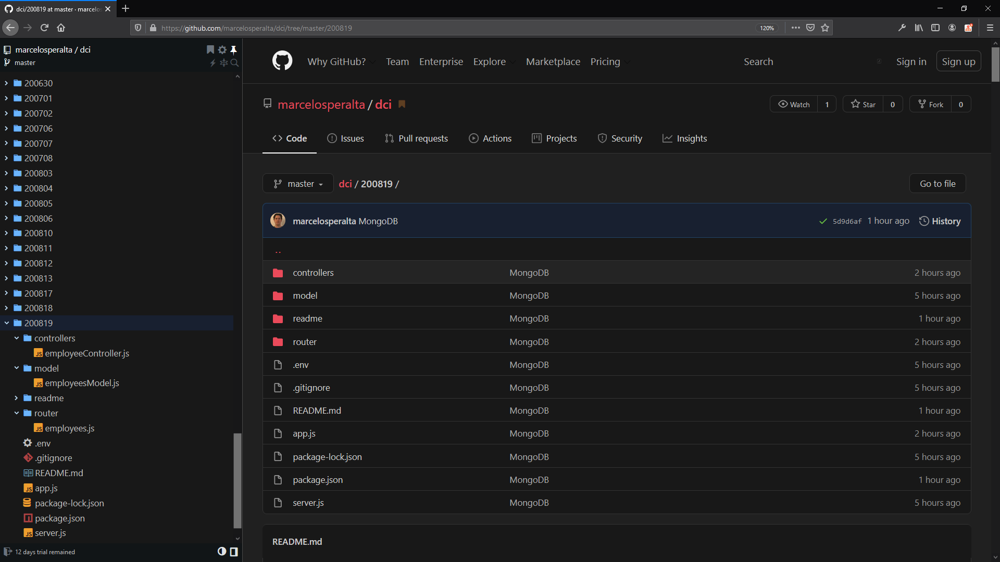
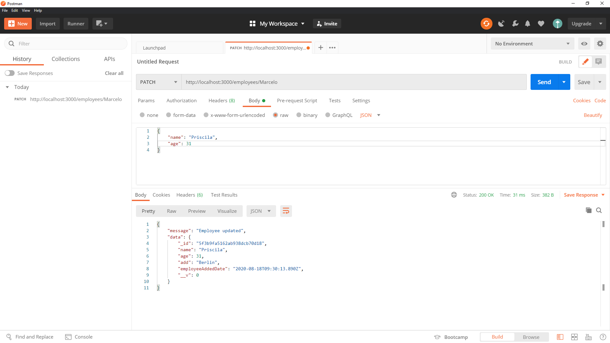

# MongoDB

## run on Windows 10

Run MongoDB Community Edition from the Command Interpreter<br><br>

:rotating_light:  **IMPORTANT**  :rotating_light:

_You must open the command interpreter as an Administrator._

<br>

**Start your database**

```
cd C:\Program Files\MongoDB\Server\4.4\bin\
```

```
mongod.exe --dbpath="c:\data\db"
```

If the MongoDB database server is running correctly, the Command Interpreter displays:  

**[initandlisten] waiting for connections**  


<br><br>

**Connect to MongoDB**

To connect a mongo.exe shell to the MongoDB instance, open another Command Interpreter with :warning: Administrative privileges :warning: and run:

````
"C:\Program Files\MongoDB\Server\4.4\bin\mongo.exe"
````


<br>

**Create a empty Database using MongoDB Compass Community**


# Connection with MongoDB using JavaScript, Node.js, Express, Mongoose and Dotenv

## :computer: Installing the project based on existing ```package.json```

```
git clone https://github.com/marcelosperalta/dci/tree/master/200818
```

```
npm install
```
or  

:dvd: Create a new ```package.json```

```
git init -y
```

:dvd: Add the line below into ```package.json```

```
  "scripts": {
    "start": "nodemon server.js"
  },
```

:dvd: Install [express](https://www.npmjs.com/package/express)

```
npm i express
```

:dvd: Install [mongoose](https://www.npmjs.com/package/mongoose)

```
npm i mongoose
```

:dvd: Install [nodemon](https://www.npmjs.com/package/nodemon)

```
npm i nodemon
```

:dvd: Install [morgan](https://www.npmjs.com/package/morgan)

```
npm i morgan
```

:dvd: Install [dotenv](https://www.npmjs.com/package/dotenv)

```
npm i dotenv
```

:page_facing_up: Create an ```.env``` file and add the lines below

```
PORT=3000
DB_URL=mongodb://localhost:27017/employees
```

<div align="center">:rotating_light: :rotating_light: :rotating_light: :rotating_light: :rotating_light:</div>
<div align="center">The <code>.env</code> was not added to the <code>.gitignore</code> because this is a repository for study.<br>
In a company envirorment, never push this type of file to a repository like GitHub (or any other version control system).<br>:link: See <a href="https://12factor.net/config">The Twelve-Factor App - Config</a></div>
<div align="center">:rotating_light: :rotating_light: :rotating_light: :rotating_light: :rotating_light:</div>

:page_facing_up: Create an ```.gitignore``` file and add the line below

```
node_modules
```

:page_facing_up: Create an [app.js](https://github.com/marcelosperalta/dci/blob/master/200818/app.js) and [server.js](https://github.com/marcelosperalta/dci/blob/master/200818/server.js) files and copy de code from this repository.  

:file_folder: Create a [model](https://github.com/marcelosperalta/dci/tree/master/200818/model) folder, create an [employeesModel.js](https://github.com/marcelosperalta/dci/blob/master/200818/module/employeesModel.js) file inside, and copy de code from this repository.  

:file_folder: Create a [router](https://github.com/marcelosperalta/dci/tree/master/200818/router) folder, create an [employees.js](https://github.com/marcelosperalta/dci/blob/master/200818/router/employees.js) file inside, and copy de code from this repository.  

:file_folder: Create a [controllers](https://github.com/marcelosperalta/dci/tree/master/200818/controllers) folder, create an [employeesController.js](https://github.com/marcelosperalta/dci/blob/master/200818/controllers/employeeController.js) file inside, and copy de code from this repository.  

**_Project Structure:_**

  
:arrow_up: Navigation on GitHub using [Octotree](https://www.octotree.io/)

## :runner: Run the project

````
npm start
````


:arrow_up: GIF generated with [ShareX](https://getsharex.com/)  

**or run using [Gitpod](https://www.gitpod.io/)**  

[](https://gitpod.io/#https://github.com/marcelosperalta/mock-up_e-learning_platform)

### :arrow_right: Flowchart

## :cd: Using [Postman](https://www.postman.com/)

**_Get data from Database (empty scenario)_**  
GET  
http://localhost:3000/employees/  
  

**_Add data to Database_**  
POST  
http://localhost:3000/employees/  
```
{
    "name": "Marcelo",
    "age": 39,
    "add": "Berlin"
}
```
  

**_Get data from Database_**  
GET  
http://localhost:3000/employees/Marcelo  
  

**_Delete data from Database_**  
DELETE  
http://localhost:3000/employees/Marcelo  
  

**_Update data from Database_**  
PATCH  
http://localhost:3000/employees/Marcelo  
  
  

## Tools

<a href="https://shields.io"></a>  

