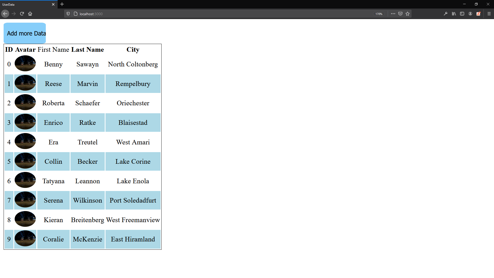

# MongoDB
<a href="https://www.mongodb.com/"></a>  

# [faker.js](https://www.npmjs.com/package/faker)  

- Generate massive amounts of fake data in the browser and node.js

# [EJS](https://ejs.co/)  

- EJS is a simple templating language that lets you generate HTML markup with plain JavaScript.

# Run the project

#1

- Create the ```.env``` file based on [this](https://github.com/marcelosperalta/dci/blob/master/200820/.env)

🚨 In a company environment, never push this type of file to a repository like GitHub (or any other version control system)

#2

```
npm install
```

#3

```
npm start
```

# On Browser

http://localhost:3000/

