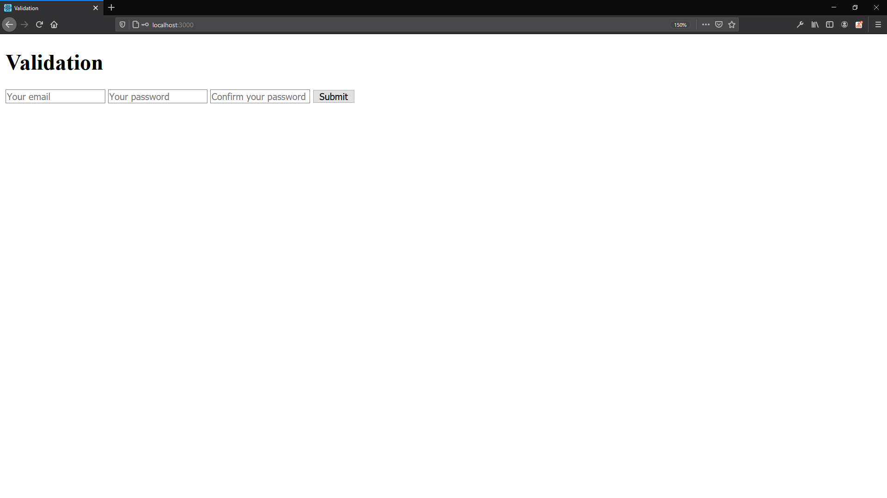
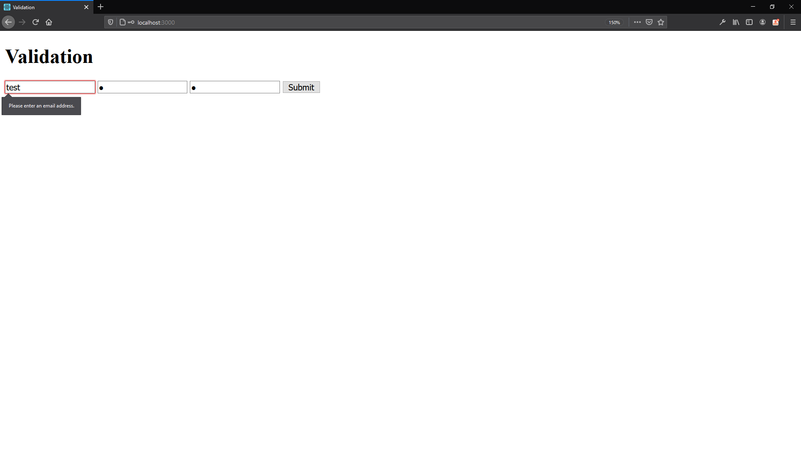
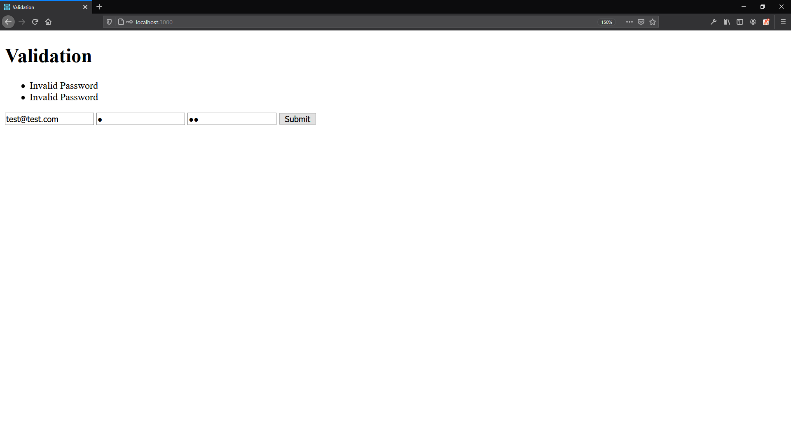

# MongoDB
<a href="https://www.mongodb.com/"></a>  

# [Handlebars](https://handlebarsjs.com/)

Handlebars is a simple templating language.  
It uses a template and an input object to generate HTML or other text formats. Handlebars templates look like regular text with embedded Handlebars expressions.  

:heavy_exclamation_mark: Other templating language: [Nunjucks](https://mozilla.github.io/nunjucks/) from [Mozilla Webdev](https://mozilla.github.io/webdev/)  

# [validator.js](https://github.com/validatorjs/validator.js)

A library of string validators and sanitizers.  

# Run the project

#1

- Create the ```.env``` file based on [this](https://github.com/marcelosperalta/dci/blob/master/200820/.env)  

🚨 In a company environment, never push this type of file to a repository like GitHub (or any other version control system)  

#2

```
npm install
```

#3

```
npm start
```
```

# On Browser

http://localhost:3000/





