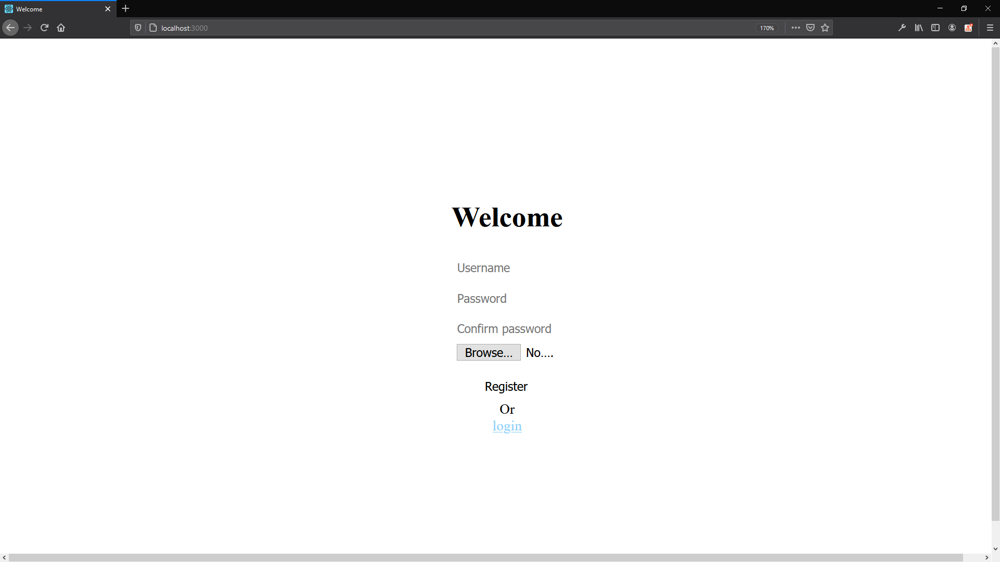

# MongoDB
<a href="https://www.mongodb.com/"></a>  

## Multer

Multer is a Node.js middleware for handling multipart/form-data, which is primarily used for uploading files. It is written on top of busboy for maximum efficiency.  

NOTE: Multer will not process any form which is not multipart (multipart/form-data).  

https://github.com/expressjs/multer  

https://www.npmjs.com/package/multer  

# Run the project

#1

Create the ```.env``` file based on [this](https://github.com/marcelosperalta/dci/blob/master/200820/.env)  

🚨 In a company environment, never push this type of file to a repository like GitHub (or any other version control system)  

#2

```
npm install
```

#3

```
npm start
```

# **[bcrypt](https://www.npmjs.com/package/bcrypt)** installation issues on Windows 10

https://github.com/kelektiv/node.bcrypt.js/wiki/Installation-Instructions#microsoft-windows

```
npm install --global --production windows-build-tools

```

# On Browser

http://localhost:3000/

